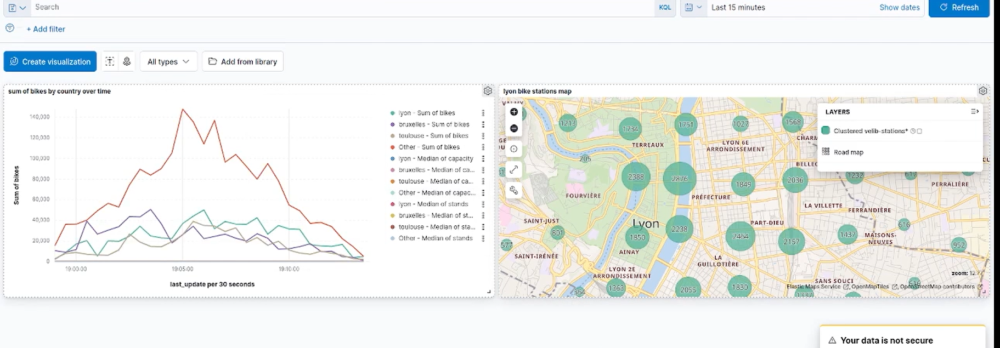

Running the Script

Before executing the main pyspark_consumer.py, ensure that Zookeeper and Kafka servers are running. You can start them using the following commands in different terminals and IN THAT ORDER:

Start Zookeeper:

    sudo ./bin/zookeeper-server-start.sh ./config/zookeeper.properties

Start Kafka

    sudo ./bin/kafka-server-start.sh ./config/server.properties

Run the get_stations.py file by doing

    python3 producer.py

after that you can run the main script with spark-submit

    spark-submit --packages org.apache.spark:spark-sql-kafka-0-10_2.12:3.1.2 consumer.py

visualization of data using kibana 

